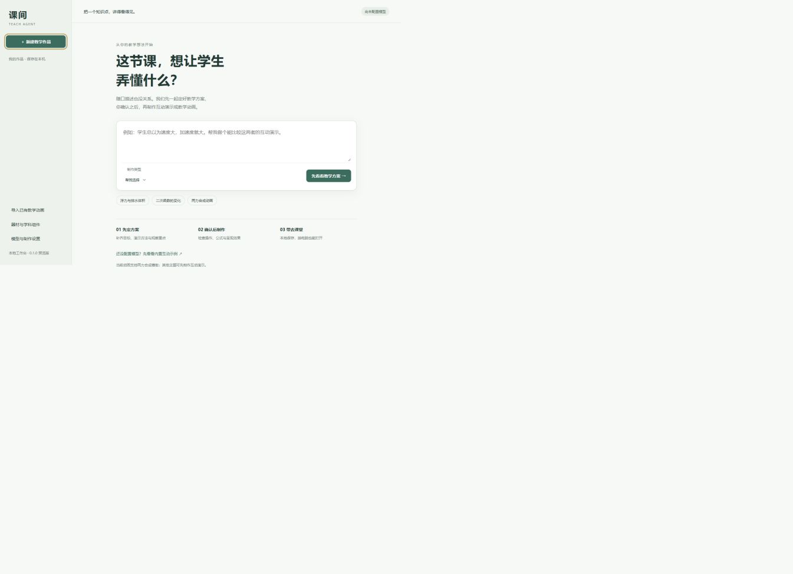

# 舍长工作台

**老师说一个教学需求，先确认教学方案，再制作能带走的互动演示和动画。**

本地运行的开源智能体。网页和 WorkBuddy 等支持 MCP 的对话工具都是完整入口，共用作品库；不需要维护公网网站。

> 0.1.0 预览版。WorkBuddy 对话模式默认由当前对话模型处理教学设计、代码和复核，使用宿主正常对话额度，无需额外 API 密钥。独立网页模式使用自行配置的 Chat Completions 模型。动画需要代码生成和图片理解能力；无需安装 Codex。真实 WorkBuddy 客户端及真实模型质量尚未验收，不代表任意课程已能高质量生成。



[English](README.en.md) · [验证记录](VERIFICATION.md) · [第三方来源](THIRD_PARTY_NOTICES.md)

## 目前能做什么

- 一句话提出需求，模型分析核心教学问题、理解难点及成因，设计针对性的讲解与互动，不要求提供学生作答记录。
- 每步明确讲解与操作的先后、可见现象、理解结论和检查方式；老师可编辑内容、增删或调整顺序。
- 方案经过单独一次模型教学复核，失败最多修正一次；通过后交给老师确认。
- 分析、设计、复核全程自动，最后只确认一次完整方案。默认展示简明摘要，可用一句话修改；详细编辑默认折叠。
- 生成互动 HTML，执行浏览器操作检查、检查布局和资源，再做模型内容复核；失败最多修复两轮。
- 自包含 KaTeX / mhchem / 字体；统一使用 Open Lab Components 的 213 个学科组件。
- 按已确认分镜通过模型 API 生成 Manim 场景，试渲染、抽帧复核、最多两轮修复，再输出并复核 720p MP4；已有 H.264 MP4 也可加入互动作品。
- 制作完成后继续修改互动作品和工作流动画，保留旧版本；任务可取消，重启后中断状态可见。
- MCP 和网页共用同一个本机服务、作品库及确认流程。

## Windows：在 WorkBuddy 里使用

1. 安装 Python 3.11 或更新版本，下载并解压本项目。
2. 双击 `setup-workbuddy.cmd`。首次安装依赖及需要的检查浏览器；使用 WorkBuddy 对话模型可以跳过 API 配置，暂不做动画可跳过 Manim 路径。若同时使用独立网页生成，可在本机向导配置 API；密钥输入不显示，也不进入聊天。
3. 向导生成 `.data/workbuddy-mcp.json`，其中已经填好本机绝对路径。在 WorkBuddy 的「插件 → MCP 服务器 → 配置 MCP」中添加这个文件里的 `teach-agent` 服务，保留其他已有服务。连接方式见 [WorkBuddy 官方说明](https://www.workbuddy.ai/docs/zh/workbuddy/From-Beginner-to-Expert-Guide/Function-Description/MCP-Guide)。
4. 连接后直接说：“用舍长工作台，做一个让初二学生理解浮力的互动演示。”智能体自动分析并整理方案；你可以说“改成先做实验”，或确认开始制作。
5. 制作完会返回本地 HTML、MP4 或完整离线包路径。继续说“把字调大”“第二段慢一点”即可修改并保留旧版本。

**无需先打开网页。** MCP 首次调用会自动启动本地服务；已有服务时直接复用。制作期间保持 MCP 连接：断开由它启动的服务会停止未完成任务，旧成品保留；重新连接后可查看状态。退出复用已有服务的连接不会关闭该服务。

网页也能独立完成需求、方案、制作、修改和导出：双击 `start.cmd`，在设置中配置模型后使用；或在聊天中说“打开舍长工作台”。两个入口共用作品、配置和版本。在网页继续对话来源的作品时，页面会明确提示使用网页模型；想继续使用 WorkBuddy 额度则回到对话。`start.cmd` 启动的服务需保留启动窗口；已由 MCP 启动时会直接打开已有服务。

制作时，需求、方案、源码及动画检查帧会交给选定的模型：对话模式返回当前宿主，网页模式发送给配置的模型 API。导出的成品在使用时不需要模型。

数据默认保存于启动器旁边的 `.data/`，包含作品、配置和本机访问码。**不要上传 `.data/` 或 `.env` 到代码仓库。** 模型密钥保存在本机配置文件中，不属于系统凭据保险库；浏览器只显示是否已设置，不回传密钥。

其他系统或开发模式：

```sh
python -m venv .venv
# 先激活虚拟环境
python -m pip install -e '.[dev]'
python -m playwright install chromium
python -m teach_agent.onboarding --data-dir .data
# 将向导生成的 MCP 配置添加到客户端；网页是可选入口：
# python -m teach_agent --data-dir .data --open
```

已在 Windows / Python 3.12 验证，macOS/Linux 尚未实机验证。首次安装和使用在线模型需要网络。

## 动画与已有工作流

教学设计、互动网页和动画使用同一条制作流程。WorkBuddy 对话模式由当前对话模型处理各个生成和复核步骤，无需另填 API；独立网页模式共用“设置”中的模型地址、名称和 API 密钥，兼容 Chat Completions。动画要求所选模型能看图和生成代码；不需要 Codex、ChatGPT 账号或任何智能体 CLI。

在“动画制作设置”填写已有 Manim 环境内 Python 的完整路径。验证用 Manim 为 0.20.1。复杂公式还需要可用的 LaTeX / dvisvgm；程序不会把缺少公式当成成功。

流程：老师一句话 → 自动教学设计与分镜 → **老师确认一次** → 程序沿用已确认的目标、教学顺序和分镜 → 模型整理学科实现要点 → 编写场景代码 → 本地低清试渲染 → 将实际抽帧图片送给模型复核 → 最多两轮局部修复 → 输出 720p 并再次复核。中途不要求老师逐步确认。通常确认后需要模型处理4个步骤（学科实现要点、场景、预览看图、成片看图），失败会增加处理次数；实际耗时仍待真实模型测量。

程序负责流程、文件写入、执行和重试。独立 API 模型只需返回结构化内容，不要求工具调用；对话模式要求宿主能调用 MCP 工具并提交结果。图片在 API 模式中使用 image_url，在对话模式中使用标准 MCP ImageContent。无法查看图片时须明确失败，不允许退回仅看文字并声称已检查。宿主复核是当前对话模型的另一个步骤，不是独立模型的盲审。

方案确认页显示每段画面、变化与时长。完成后可继续用一句话提出局部修改，旧场景作为参考，旧版本保留。改变教学目标或结构时先重新确认方案。旧的 Sol 标记方案仍可读取，但制作统一走模型 API；两力合成固定模板仅兼容历史作品。

生成的 Python 在本机 Manim 环境中执行；静态检查、限定目录和清理敏感环境变量属于防护措施，**不是操作系统级沙箱**。模型密钥只保存在本机设置，传给工作进程时使用管道，不写入作品目录、命令行或场景进程环境。

可保存 MP4 或包含场景、分镜、复核记录和代表帧的编辑工程。互动作品也能通过“加入已有动画”附加视频；组合版本需回原互动版本修改后再加入视频。

## 带去另一台电脑

| 成品 | 保存方式 | 使用方式 |
| --- | --- | --- |
| 互动演示 | HTML | 双击，用现代浏览器打开；公式、字体、器材均内嵌 |
| 动画 | MP4 | 用支持 H.264 的播放器播放 |
| 互动 + 动画 | 完整离线 ZIP | 全部解压后打开 `index.html`，保留 `assets/` |
| 继续开发 | 编辑工程 ZIP | 包含方案、生成源码、检查报告、成品和声明，可手动编辑；本版尚无工程重新导入入口 |

离线检查已在本机新目录中运行；尚未拿到另一台物理电脑验证。收录 213 个组件不代表每一个都已完成行为、科学和视觉验收。自动复核也不能代替老师检查教学内容。

## 接入 WorkBuddy 等支持 MCP 的工具

`setup-workbuddy.cmd` 已生成可直接使用的配置。手工配置其他客户端时，新增 **stdio MCP 服务**，将以下路径改为自己的绝对路径。无需事先启动网页，数据目录与网页一致即可共享作品：

```json
{
  "mcpServers": {
    "teach-agent": {
      "command": "D:/your-folder/teach-agent/.venv/Scripts/python.exe",
      "args": ["-m", "teach_agent.mcp_server"],
      "env": {
        "PYTHONPATH": "D:/your-folder/teach-agent",
        "TEACH_DATA_DIR": "D:/your-folder/teach-agent/.data",
        "PYTHONUTF8": "1"
      }
    }
  }
}
```

对话流程：`prepare_lesson` → `wait_for_lesson` → 自动处理模型步骤 → 返回完整方案摘要 → 老师确认 → `confirm_and_make` → 自动处理制作与检查 → `export_lesson` 返回本地文件。等待工具每次最多等待25秒，返回真实阶段。默认按成品选择 HTML / MP4 / ZIP。方案修改用 `revise_plan`，成品修改用 `revise_lesson`；还可查看作品、进度和取消任务。需要网页时使用 `open_workbench`。

默认 `generation_mode=host`：等待结果中出现 `get_generation_step` 时，宿主读取完整提示词、输入和图片，由当前对话模型完成该步骤，再调用 `submit_generation_step` 提交 JSON，继续等待。这个循环由工具说明引导，无需老师复制内容或逐步确认。不提取宿主账号或密钥、不调用未公开额度接口，也不依赖 MCP Sampling。宿主模型处理这些内容时按宿主正常规则计费；额度不足、模型能力不足或客户端中断仍可能失败。需要已有自配 API 时可显式选择 `generation_mode=api`，不会自动切换。每个任务保存自己的模式，避免两个入口互相改配置。

宿主必须先展示方案，等老师明确确认，才调用制作工具。`teacher_confirmed` 是宿主遵守的人机交互约定，不是抵抗恶意宿主的权限机制。WorkBuddy 自身的工具调用授权由客户端控制，与产品的一次教学方案确认不同。

已用官方 Python SDK 验证冷启动、工具发现、无额外 API 的宿主模型步骤循环、方案确认、制作和本地交付；API 模式的修改、并发启动复用和退出也有覆盖。测试用固定响应模拟宿主模型，只验证流程。**WorkBuddy 客户端实际对话与额度扣费尚未实测**；客户端能否正确执行工具循环、显示图片及承载长上下文仍需验收。

## 开发与边界

```sh
python -m pytest tests -q
```

`teach_agent/prompts.py` 管教学设计、制作、复核提示词；`materials.py` 管统一组件和离线公式；`animation_worker.py` 和 `animation_workflow.py` 用代码组织 API 调用和渲染流程，`animation_templates/` 仅兼容旧作品。组件新增优先扩展同一视觉体系。源码及第三方原始许可证都在仓库内。

教学设计的流程是：分析老师需求 → 找出知识点难在哪里、为什么难 → 选择解决办法 → 安排讲解和交互顺序 → 模型复核 → 老师修改确认 → 制作。预测题、比较实验按需要使用，没有强制课前诊断环节。通常准备方案调用模型两次（设计与复核）；自动修正最多增加两次，实际耗时取决于模型。

从 html-anything 选择接入三个提示词文件的相关片段：`teaching.md` 的演示结构、教学表达和反例；`_system.md` 的风格一致性、有效交互和界面质量规则；`_design.md` 中仅间距、圆角、阴影尺度规则。原始文件和 MIT-0 许可证保存在 `teach_agent/prompt_library/`，实际选择逻辑在 `prompt_sources.py`。不加载其外部字体、品牌色、行星素材、其他风格和未实现的文件导入规则。任务和成品检查报告记录所用片段的来源、版本与文件哈希。

运行时仅绑定 `127.0.0.1`；API 需要本机访问码，拒绝跨站来源；生成预览使用隔离 iframe，检查器使用独立浏览器并阻断未打包请求。它不是多人公网服务，不提供远程认证或托管功能。

当前优先补充：真实 WorkBuddy 对话与模型生成的学科样例验收、组件行为适配、工程重新导入。对话和 API 各自串行排队，等待宿主时不阻塞独立网页任务；两类任务可同时制作，会共享本机资源。按需组件和两轮修复上限控制工作量，尚无真实模型延迟基准。

## 实验源码与交互参考

新增 27 个独立实验项目的源码快照（约 104 MB），另有 5 个仅参考链接。来源、固定版本和许可完整保留；这些是供查阅开发的资源，并非 27 个已接好的实验。网页在“设置 → 实验源码与参考”中查看；WorkBuddy 可查找并导出带声明的源码。详见 [资源清单与使用说明](docs/experiments/README.md)。

互动制作已加入拖动、吸附、按帧更新、暂停和复位规则，可内联使用轻量交互辅助代码；网页和对话共用。器材继续保持同一视觉体系。
